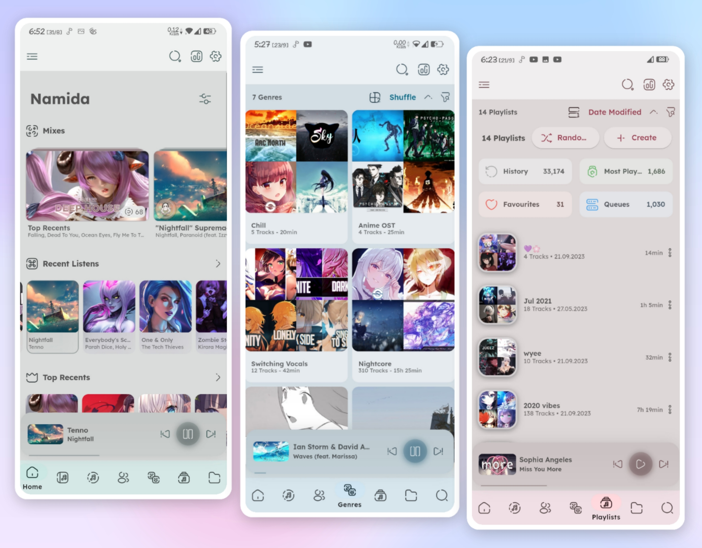
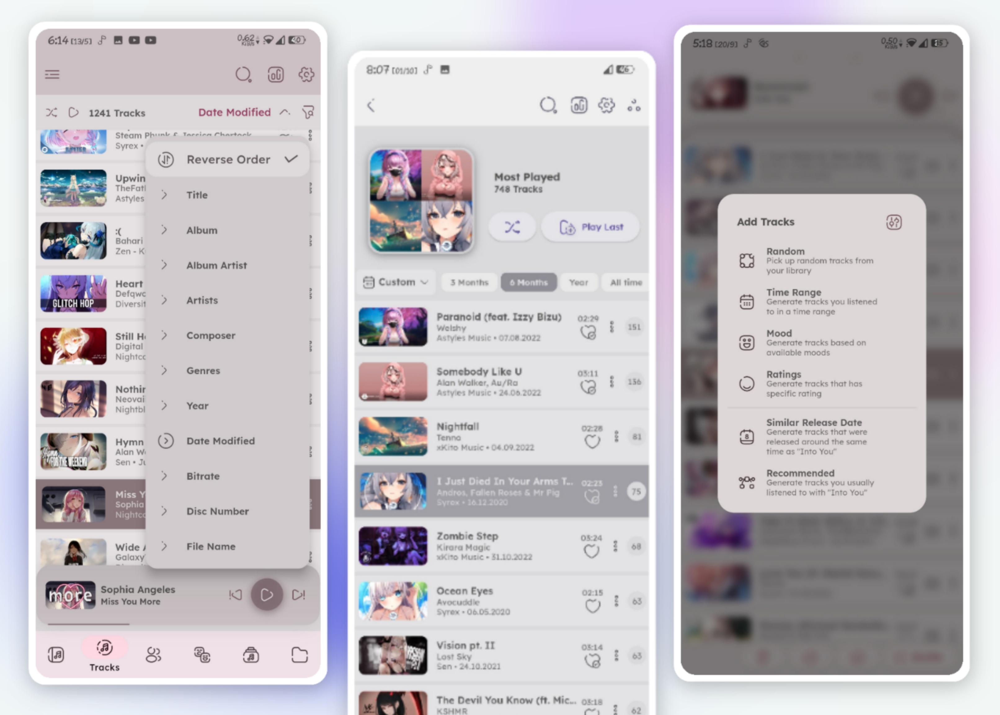
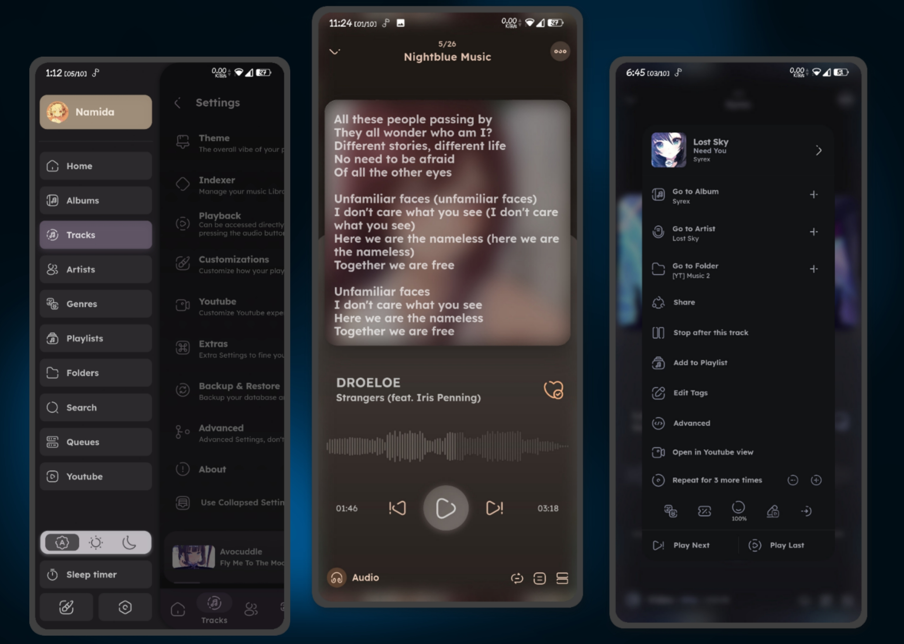
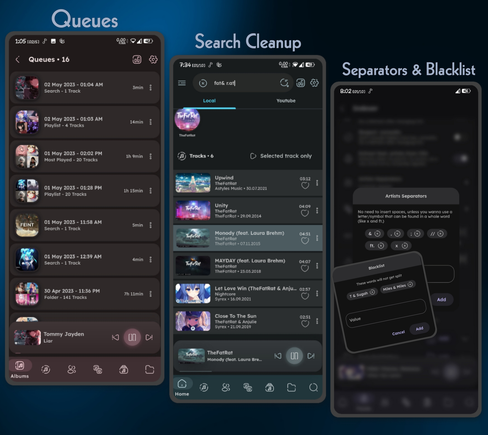
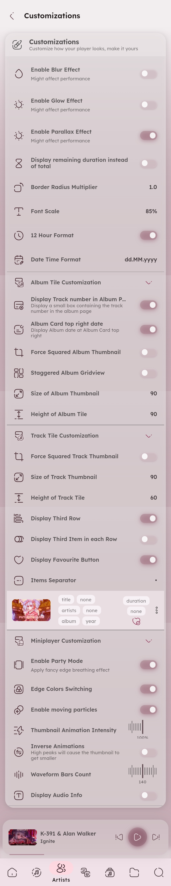
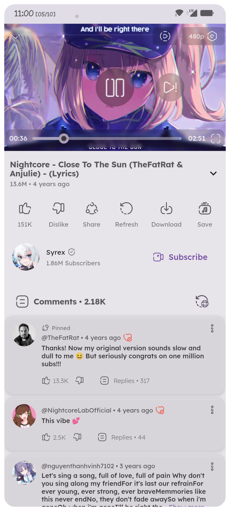

<link rel="stylesheet" href="styles.css" />

# <div style="margin-right: 18px; margin-top: 18px; display:flex; vertical-align: middle; align-items: center; max-width: 100%;">Namida</div>

A Beautiful and Feature-rich Music & Video Player with Youtube Support, Built in Flutter

<a href="https://github.com/flutter/flutter">
</a>
<a href="https://t.me/namida_official">
</a>
<a href="https://t.me/+FmdfsgKoGmM1ZGFk">
</a>
<a href="https://discord.gg/WeY7DTVChT">
</a>
<a href="https://github.com/namidaco/namida/releases">

</a>
<a href="https://github.com/namidaco/namida/releases">
[](https://hitsofcode.com/github/namidaco/namida/view?branch=main)
</a>
<a href="https://github.com/namidaco/namida/releases">
[](https://ghloc.vercel.app/namidaco/namida?branch=main)
</a>
<a href="https://translate.codeberg.org/engage/namida-translations/">

</a>

# Sections:

- [Features](#-features)
  - [Library \& Indexing](#library--indexing)
  - [Look \& Feel](#look--feel)
  - [Streaming & Youtube](#streaming--youtube)
  - [Others](#others)
  - [Some additional cool features](#some-additional-cool-features)
- [Video Integration](#video-integration)
- [Screenshots](#screenshots)
- [Usage Preview](#usage-preview)
- [Installation](#installation)
- [Permission Note](#permission-note)
- [Special Thanks](#special-thanks)
- [Contribute](#contribute)
- [Donate](#donate)
- [Social](#social)
- [LICENSE](#license)

# 🎉 Features

- Everything you might expect from a music player, in addition to the following:

## Library & Indexing

- Powerful Indexer & Tag Editor, powered by @jaudiotagger.
- Artists and Genres Separators.
- Prevent Duplicated Tracks.
- Set Minimum File Size & Duration.
- Folders-based Library system, with the ability to exclude folders as well.
- Sort by almost any property of the track or the album.. etc.

## Look & Feel

- Material3-like Theme.
- Dynamic Theming, Player Colors are picked from the current album artwork.
- Home, Tracks, Albums, Artists, Genres, Playlists, Queues and Folders Pages.
- Waveform Seekbar.
- Lots of customizations (check out [customization section](#customization-settings)).

## Streaming & Youtube

- Best Video & Audio Quality
- Audio Only Mode
- Support Downloads, Caching & Offline Playback
- Video View with gestures support (swipe to control volume, double tap to seek, swipe up/pinch in to enter fullscreen, etc)
- Edit tags for downloads
- Optional Auto title/artist/album extraction for downloads and scrobbling
- Downloads output filename builder (similar to yt-dlp)

<details>

<summary>Available formats & example</summary>

- Formats:
  - `video_id`, `id`: video identifier
  - `video_url`, `url`: video full url (https://www.youtube.com/watch?v=`id`)
  - `video_title`, `fulltitle`: video full title
  - `title`: extracted music title from video title (*Navjaxx - **<ins>Fading Light</ins>** (Slowed)*)
  - `artist`: extracted music artist from video title (***<ins>Navjaxx</ins>** - Fading Light (Slowed)*) or else `channel`
  - `genre`: music genre. automatically set to ***Nightcore*** when the video title contains "nightcore".
  - `ext`: format container extension (mp4, m4a, webm). this is not necessary as it would be added automatically
  - `channel_fulltitle`: channel full name
  - `channel`, `uploader`: channel name (excluding ` - Topic`)
  - `channel_id`, `uploader_id`: channel id
  - `channel_url`, `uploader_url`: channel url
  - `timestamp`: UNIX timestamp of the video (milliseconds since epoch)
  - `upload_date`: upload date of the video, converted to local time (yyyyMMdd)
  - `view_count`: view count of the video
  - `like_count`: like count of the video
  - `description`: video description. links are wrapped in a markdown style
  - `duration`: video duration in seconds (204)
  - `duration_string`: video duration formatted (3:24)
  - `playlist_title`: title of the playlist containing the video
  - `playlist_id`: id of the playlist containing the video
  - `playlist`: `playlist_title` if available or else `playlist_id`
  - `playlist_count`: total videos count in the playlist
  - `playlist_index`: index of the video in the playlists (starts at 0)
  - `playlist_autonumber`: position of the video in the playlists (starts at 1)
  - `none`: empty field. useful for tags to override any other settings

- Example: 
```bash
# [04] music title [(channel name)]
[%(playlist_autonumber)s] %(title)s [(%(channel)s)]

# saving to separate folders
# music playlist/02. music title.m4a
%(playlist)s/%(playlist_autonumber)s. %(title)s.%(ext)s
```

</details>

## Others:

- Lyrics auto fetching & displaying (Synced & Plain).
- Sleep Timer (Tracks or Minutes)
- Crossfade, Play/Pause Fade Effect, along with Skip Silence.
- Replay Gain (Normalize Audio)
- Control pausing scenarios (calls, notifications, volume 0, etc..)
- Define parameters to use for filtering tracks in search lists.
- Global Tracks Selection
  - allows u to select from multiple places into the same list.
- Never miss your sessions!
  - persistent and reliable queue system, your sessions are saved for later usage.
- Reliable History System
  - despite being a flexible system (easily modified, manipulated, imported), it lets u specifiy minimum seconds/percentage to count a listen.
- Most Played Playlist
  - find out your top tracks based on your history record.

## Some additional cool features:

- Smort Tracks Generation:
  - uuh.. with dis advanced algorithm brought for you, u can generate tracks related to one you currently listening to, typically the ones that you often listened to in the same period. based on your history.
  - also u can generate tracks released around the same time, or from specific range of time, from ratings, from available moods, or randomly.
- Animating Thumbnail:
  - A thumbnail that animates with the current audio peak, looks cool.
- Miniplayer Party Mode:
  - Applies an edge breathing effect, colors can be static or dynamic (all the colors extracted from the artwork)
- Particles Effect
  - they speed up with the audio peak too
- Track Play Mode 
  - when playing from search, you can selected whether to play: selected track only, search results, album, first artist or first genre.
- Insert after latest inserted
  - Want to insert multiple tracks one after each other? this will get your back.
- Repeat for N times
  - in addition to normal repeat modes (all, none, one), this one lets you repeat the track for number of times before playing the next track.
- Extract feat. & ft. artist
  - u won't miss the featured artists in the title, they'll have their own entry inside artists tab.
- Dive into your memories
  - Find out ur long partners u forgot about, "lost memories" allows u to meet tracks you listened to around this time, but n years ago
  - The "Most Played" page also allows you to specify time range, showing ur most beloved tracks at that time
  - The "Recommended" tracks addition in queue lets you add tracks you usually listened to with the current one 
  - The "Similar Release Date" tracks addition in queue lets you add tracks released around the same time as the current one 
- <p>CAN IMPORT YOUTUBE HISTORY </p>
- <p>LASTFM TOO AND MAYBE MORE IN FUTURE </p>
- you gonna find decent amount of options/customizations in the settings and inside dialogs so make sure to check them out.

# Video Integration

- For Local Library, Namida is capable of playing videos related to the music, Video can be found either locally or fetched from youtube

<details>
<summary>

###### How locally?

</summary>
typically looks (inside the folders you specificed) for any matching title, matching goes as following:
<br>
-- Alan walker - Faded.m4a
<br>
-- video alAn WaLkER - faDed (480p).mp4
<br>
the video filename should contain at least one of the following:
 <br>
   1. the music filename as shown above.
 <br>
   2. title & first artist of the track.
 <br>
   3. track youtube id (in track comment tag/filename, see "#How youtube?" section below).
<br>
note: some cleanup is made to improve the matching, all symbols & whitespaces are ignored.
</details>

<details>
<summary>

###### How youtube?

</summary>

  - looks up in the track comment tag (as they are mostly done by @yt-dlp) or filename for any matching youtube link, if found then it starts downloading (and caches) and plays once it's ready, streaming here isn't a good idea as the priority goes for the music file itself.
    - for comment tag, any url format should get matched normally.
    - for filenames, it should contain `v=video_id` or `id=video_id` in order to get matched.
  
</details>

- Since v4.0.0, full video library indexing & playback is supported, videos can now be played independently, as well as dedicated videos folder view.

# Screenshots







<details>
  <summary>

### Customization Settings

  </summary>
    
</details>

<details>
  <summary>

### YouTube Miniplayer

  </summary>
    
</details>
<br>

### Usage Preview

Animating Thumbnail        |  Recommends & Listens
:-------------------------:|:-------------------------:
<video src="https://github.com/namidaco/namida/assets/85245079/da47c270-9f45-4ff5-a08e-e99e4b7ebb7c.mp4"> |  <video src="https://github.com/namidaco/namida/assets/85245079/72e978b3-6e15-4b4e-948a-03b470802b30.mp4">


# Installation

- Namida is available for 
  - **Android** (stable/beta) 
  - **Windows** (beta) <sub>`new`</sub> 
- Stable downloads: [stable-releases](https://github.com/namidaco/namida/releases)
- Beta downloads: [beta-releases](https://github.com/namidaco/namida-snapshots/releases)

### Permission Note:

#### The permissions namida uses and why:
> - `WAKE_LOCK` & `FOREGROUND_SERVICE` & `FOREGROUND_SERVICE_MEDIA_PLAYBACK`: keep app alive for media playback.
> - `INTERNET`: for many stuff like artist/album images, streaming & downloading, etc.
> - `READ_EXTERNAL_STORAGE` (Android ≤ 12): list files from indexer folders only.
> - `READ_MEDIA_AUDIO` (Android 13+): list audio files from indexer folders only.
> - `READ_MEDIA_VIDEO` (Android 13+): list video files from indexer folders only (for video playback).
> - `READ_MEDIA_IMAGES` (Android 13+): list image files from indexer folders only (for fallback covers).
> - `WRITE_EXTERNAL_STORAGE` (Android ≤ 10): same as below but less restrict.
> - `MANAGE_EXTERNAL_STORAGE` or `all_files_access` (Android 10+ / requested when needed): used for
>    - editing audio tags
>    - creating or auto-restoring backups
>    - saving artworks
>    - deleting files
>    - compressing images & fix ytdlp images
>    - exporting playlists as m3u
>    - downloading youtube content
>    - playing tracks from a root folder
>    - in-app file browser
> - `VIBRATE`: vibrate/haptic feedback while doing some actions (can be turned off in settings).
> - `POST_NOTIFICATIONS` (requested when needed): post notifications like history import/download progress 
> - `REQUEST_IGNORE_BATTERY_OPTIMIZATIONS` (requested when needed): improve downloads.
> - `WRITE_SETTINGS` (requested when needed): to set audio as ringtone/etc.

### Special Thanks:

> - [@MSOB7YY](https://github.com/MSOB7YY) for their youtube client, which powers youtube section.
> - [@010101-sans](https://github.com/010101-sans) for creating [namida_sync](https://github.com/010101-sans/namida_sync), which makes syncing namida backups/files between android/windows easier.
> - [@cameralis](https://github.com/cameralis) for their awesome miniplayer physics.
> - [@alexmercerind](https://github.com/alexmercerind) for helping me out a lot.
> - [@lusaxweb](https://github.com/lusaxweb) for their awesome Iconsax icon pack.
> - All packages' maintainers which made namida possible.
>   <br>

> ### © Logo by @midjourney
> ###### thanks [@sujxl24](https://github.com/sujxl24) for the monet version

# Contribute
- You can help translating Namida to your language on [translation repo](https://github.com/namidaco/namida-translations)
- Building is not currently possible, see why on https://github.com/namidaco/namida/issues/37#issuecomment-1780341883

# Donate

- Donation will help improve namida and will show appreciation.

<a href="https://www.buymeacoffee.com/namidaco" target="_blank"></a>

[](https://ko-fi.com/U7U0PF2L5)

> Bitcoin (BEP20): 0x95b2834c84def92860df773d8b3d80d4c296d748

> ETH/MATIC (BEP20): 0x95b2834c84def92860df773d8b3d80d4c296d748

> USDT (BEP20): 0x95b2834c84def92860df773d8b3d80d4c296d748

- Don't forget to 🌟 star the repo if you like the project.

# Social
- join us on our platforms for updates, tips, discussion & ideas
  - [Telegram (Updates)](https://t.me/namida_official)
  - [Telegram (Chat)](https://t.me/+FmdfsgKoGmM1ZGFk)
  - [Discord](https://discord.gg/WeY7DTVChT)
- ⚠️ there are no websites for namidaco/namida other than github & telegram, we are not resposible for downloading from other sources.

# LICENSE

Project is licensed under [EULA](https://github.com/namidaco/namida/blob/main/LICENSE) License.

```
© Copyright (C) 2023-present Namidaco <namida.coo@gmail.com>
- You may read/compile/modify the code for your personal usage, or for the purpose of contribution for the software.
- Redistributing the program as a whole under different name or license without permission is not allowed.
```

<a href="https://star-history.com/#namidaco/namida&Date">
 <picture>
   <source media="(prefers-color-scheme: dark)" srcset="https://api.star-history.com/svg?repos=namidaco/namida&type=Date&theme=dark" />
   <source media="(prefers-color-scheme: light)" srcset="https://api.star-history.com/svg?repos=namidaco/namida&type=Date" />
   
 </picture>
</a>